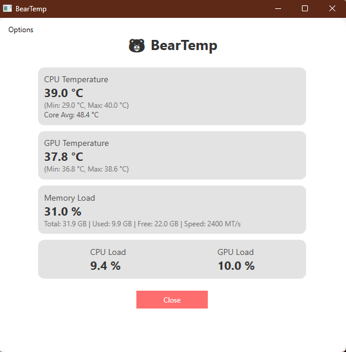

# BearTemp 🐻🔥

BearTemp is a modern Windows desktop application built with **WPF (Windows Presentation Foundation)** to monitor real-time system metrics such as CPU temperature, GPU temperature, memory load, and system load. It's designed to provide a clean, modern interface inspired by Windows 11.

## 

## Features

- **CPU Monitoring**:
  - Displays CPU Package temperature (main).
  - Tracks Core Average temperature.
  - Maintains real-time Min/Max CPU temperature values.
- **GPU Monitoring**:
  - Displays GPU temperature.
  - Tracks real-time Min/Max GPU temperature values.
  - Monitors GPU load.
- **Memory Load**:
  - Displays in-use memory as a percentage.
  - Provides details on total memory, used memory, and free memory in GB.
  - Displays memory speed (MT/s).
- **System Load**:
  - Real-time monitoring of CPU and GPU load percentages.

## Installation

1. Clone or download the repository.
2. Open the solution file (`BearTemp.sln`) in Visual Studio.
3. Build and run the project.

## Requirements

- **.NET Framework 4.7.2** or later.
- Windows 10 or later.
- Administrator privileges (optional, for accessing low-level system information).

## How It Works

BearTemp uses the following libraries and technologies:

- **LibreHardwareMonitor**: For accessing hardware sensors (CPU, GPU, Memory).
- **Windows Management Instrumentation (WMI)**: For retrieving system details like memory speed and usage.
- **WPF**: For creating a modern, responsive UI.

The app updates metrics every second using a `DispatcherTimer` to ensure real-time accuracy.

## Usage

1. Launch the application.
2. View real-time metrics in the clean, organized UI:
   - CPU Temperature: Displays the package temperature as the main number, with Min/Max tracking and Core Average temperature.
   - GPU Temperature: Shows the average temperature and Min/Max tracking.
   - Memory Load: Displays in-use memory percentage, along with details on total, used, and free memory in GB, and memory speed.
   - CPU & GPU Load: Displays real-time percentages.

## Options Menu

- **Reset Values**:
  - Resets Min/Max temperature values for both CPU and GPU.
  - Clears all displayed metrics.
- **Enable Run as Admin**:
  - Relaunches the application with administrator privileges for full hardware access.

## Future Improvements

- Add support for fan speed monitoring.
- Export metrics to a file (CSV or JSON).
- Dark mode toggle.

## License

This project is licensed under the **MIT License**. See the [LICENSE](LICENSE) file for details.

---

### Acknowledgements

- **LibreHardwareMonitor**: Open-source library for hardware monitoring.
- **Microsoft WPF**: For providing a powerful framework to build the UI.
